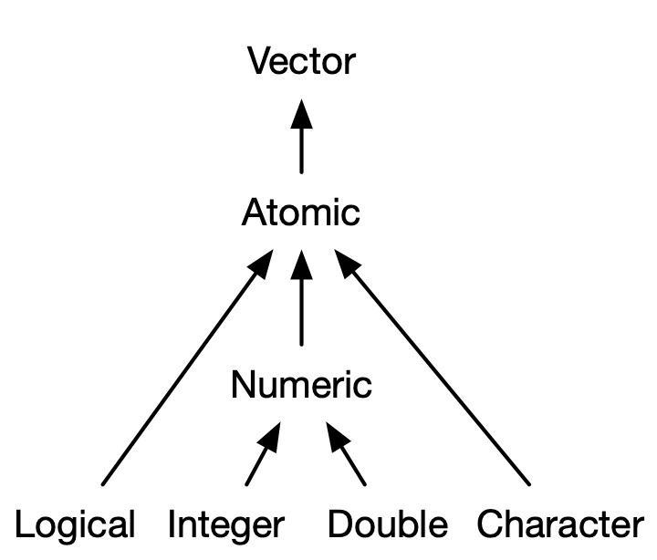

## Markup Languages 

> use specific sets of instructions that explain how a document should appear - what different parts of a document are and how they should be formatted on the page. 

##### **HTML**: 
the fundamental markup language that browsers use to render pages. Allows website creation and linking between sites    

##### **LaTeX**: 
gives the user extremely good control over the formatting of documents (books, articles) but is best used with complex projects   

Some sample LaTeX code to try out:  
```
\documentclass{article}

\begin{document}
\SweaveOpts{concordance=TRUE}


\section{First header}
\subsection{Second header}
\subsubsection{Third header}

Plain text is much the same, even in \LaTeX.

Here is \textbf{bold face}\\
Here is \textit{italic text}\\
Here is \texttt{plain text}.

``Use double back ticks and single quotes to start and finish a quotation.''

\begin{itemize}
  \item first bullet
  \item second bullet
  \item third bullet
\end{itemize}

\begin{enumerate}
  \item number one
  \item number two
  \item number three
\end{enumerate}

\begin{verbatim}
This is more convenient for a larger block of verbatim text. 
This is equivalent to the ``` plain fencing ``` from markdown.
\end{verbatim}

\begin{quote}
Again, works better for a much more extensive paragraph of quoted text such as this.
\end{quote}

<<echo=TRUE>>=
x <- runif(10)
y <- runif(10)
plot(x,y)
@

% In contrast to R and shell scripts, the character for a comment in LaTeX is the % sign.

Use the ``escape'' sequence to show a percentage sign like this: \%.

\end{document}
```

##### **Markdown**: 
more user friendly and versatile!  

## Using markup languages in other programs  

* RStudio  
  + RMarkdown - write in markdown and convert to html or pdf  
  + LaTeX via Beamer slides and Sweave  
  
* Typora: simple to use markdown editor 
  + https://typora.io/  

* Overleaf: uses LaTeX and has many nice templates 
  + https://www.overleaf.com/
  
* Using `jekyll` themes with GitHub
  + Allows you to create a personal website  
  + Requires some understanding of HTML  
  + Free themes here: https://jekyllthemes.io/free 

---
## History of R
- Early languages FORTRAN, C
- S language in 1970s; programming plus stats, matrix algebra, graphics later
- Open-source R in 1992; first stable version in 2000

## Programming in R 
- data structures and types
- writing functions
- for loops
- if..then, while statements
- structured programming
- annotation
- naming of variables
- using random numbers
- structured programming
- pseudocode

### Advantages of R 
- interpreted (for interactive use)
- graphics, statistics
- very active community of contributors
- works on multiple platforms

### Disadvantages of R 
- interpreted (slow speed)
- lazy evaluation
- functions hard to learn
- some poorly documented
- unreliable packages
- problems with big data (multiple gbs)

### Let's start with the basics

#### Assignment operator  
> used to assign a new value to a variable

```{r, eval=FALSE}
# use hash tag to make comments (R will ignore them)
# Using the assignment operator

x <- 5 # preferred
y = 4 # legal but not used except in function arguments
y = y + 1.1
print(y) # or just highlight and run y
y <- y + 1.1
print(y)
```


#### Variables  
> used to store information to be referenced and manipulated in a computer program. Named correctly, code can be understood more clearly by collaborators and others. It is helpful to think of variables as containers that hold information.  

```{r eval=F}
z <- 3 # Begin with lower case letter 
plantHeight <- 10 # option "camelCaseFormatting"
plant.height <- 4.2 # avoid periods
plant_height <- 3.3  # optimal "snake_case_formatting"
. <- 5.5 # reserve this for a generic temporary variable (more later)
```

#### Function    
> It is a block of code that performs a task.  You can use a single short command over and over again, rather than writing it out multiple times. 

```{r eval=F}
# you can create your own functions

square <- function(x=NULL){
  x <- x^2
  print(x)
}

square(4)

# or use built-in functions
numbers <- c(3, 4, 10, 2) #type ?c to read about this function
sum(numbers) # ?sum

```

#### R's Four Data Types     

Dimensions  | Homogeneous | Heterogeneous
------------- | ------------- | -------------
1-dimension  | Atomic Vector | List
2-dimensions  | Matrix | Data Frame

## Atomic Vectors
> probably the most fundamental data structure in the R programming language  

### Atomic Vector types 
- character strings
- integers
- double
- integers, doubles are "numeric"
- logical
- (factor)
- vector of lists!



#### One-dimensional vectors 

```{r, eval=FALSE}
# the combine function 
z <- c(3.2, 5, 5, 6) 
print(z)
typeof(z)
class(z)
is.numeric(z)

# c() always "flattens" to an atomic vector
z <- c(c(3,4),c(5,6)) 
print(z)

# character strings with single or double quotes
z <- c("perch","bass",'trout') 
print(z)
# use both with an internal quote
z <- c("This is only 'one' character string", 'a second')
print(z)
typeof(z)
is.character(z)

# building logicals
# Boolean, not with quotes, all caps
z <- c(TRUE,TRUE,FALSE) 

print(z)
class(z)
typeof(z)
is.logical(z)
is.integer(z)
```

#### Properties of vectors  

```{r eval=F}
# Type
z <- c(1.1, 1.2, 3, 4.4)
typeof(z) # gives type
is.numeric(z) # is. gives logical
as.character(z) # as. coerces variable
print(z)
typeof(z)

# Length
length(z) # gives number of elements
length(y) # throws error if variable does not exist

#Names
z <- runif(5)
# optional attribute not initially assigned
names(z) 
print(z)
# add names later after variable is created
names(z) <- c("chow","pug","beagle","greyhound","akita")
print(z)

# add names when variable is built (with or without quotes)
 z2 <- c(gold=3.3, silver=10, lead=2)
print(z2)
# reset names
names(z2) <- NULL
# names can be added for only a few elements
# names do not have to be distinct, but often are
names(z2) <- c("copper","zinc")
print(z2)

# NA values  
# missing data  
z <- c(3.2,3.3,NA) # NA is a missing value
typeof(z)  
mean(z) # won't work because of NA
anyNA(z)  
is.na(z) # logical operator to find missing values
which(is.na(z)) # use which to find NAs

```

#### Subsetting vectors 
```{r eval=F}
# vectors are indexed
z <- c(3.1, 9.2, 1.3, 0.4, 7.5)
z[1]
# positive index values
z[c(2,3)]
# negative index values to exclude elements
z[-c(2,3)]
# == to find exact match
z[z==1.3]

# also use which() function to find subscript indicators
which(z<3)

# this works, but is overkill; just use the boolean operator
z[which(z<3)]
z[z<3]

z <- runif(10) # simple integer sequence
print(z)

z < 0.5 # create logical vector
z[z < 0.5] # use as index call
which(z < 0.5) # use to get indices for logical
z[which(z < 0.5)] 

# also can subset using named vector elements
names(z) <- letters[1:5]
z[c("b","c")]

# subset function
subset(z, z<3)

# randomly sample from a vector
story_vec <- rep(c("A", "Frog", "Jumped", "Here"))
sample(x=story_vec) # with no other params, this reorders the vector
sample(x=story_vec, size=3) # specify a number (sampling without replacement)

# add items 
story_vec <- c(story_vec[1], "Green", story_vec[2:4])
story_vec

# replace items
story_vec[2]<-"Blue"
story_vec
```


#### Functions to create vectors  
* `c()`
```{r eval=F}
vec <- c(5, "cat", TRUE, 0.3)
typeof(vec)
```

* `vector()`

```{r, eval=FALSE}
# create an empty vector, specify mode & length
z <- vector(mode="numeric",length=0)  
print(z)
# now add elements to it
z <- c(z,5)
print(z)
# This "dynamic sizing" is very SLOW!
```


* `rep()`  
```{r eval=F}
# has 100 0s in a numeric vector
z <- rep(x=0,times=100) 
head(z)

z <- rep(x= 1:4, each=3)
z

```

* `seq()`  
```{r eval=F}
seq(from=2, to=4) # set limits for integer sequences
2:4 # very common short cut with no explicit function wrappers
seq(from=2,to=4,by=0.5) # use a by function can generate real numbers
x <- seq(from=2, to=4,length=7) # sometimes easier to just specify the length
my_vec <- 1:length(x) # commonly used, but actually slow
print(my_vec)
seq_along(my_vec) # much faster for models and big data!
seq_len(5) # this is also faster than 1:5
```


